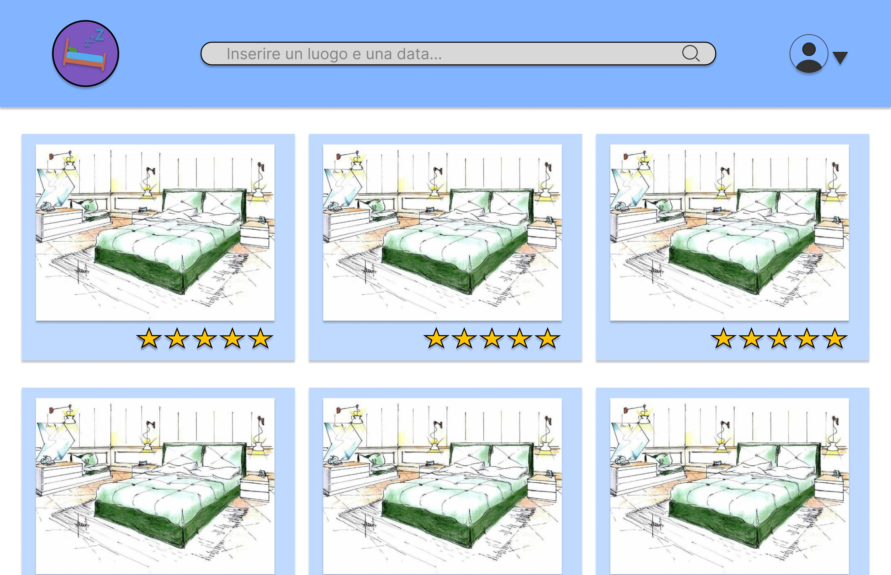
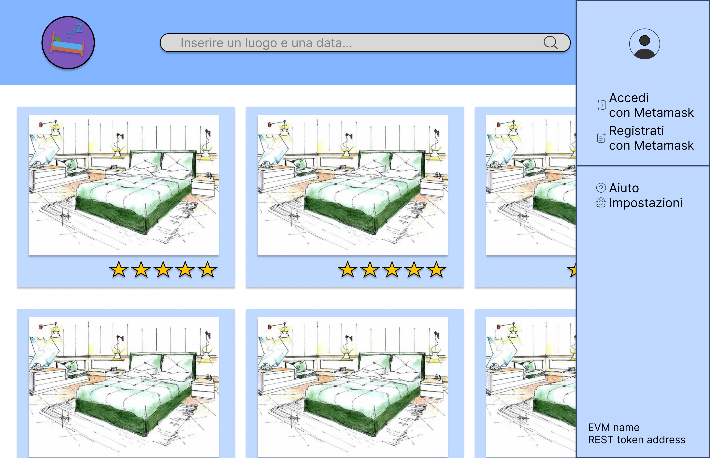
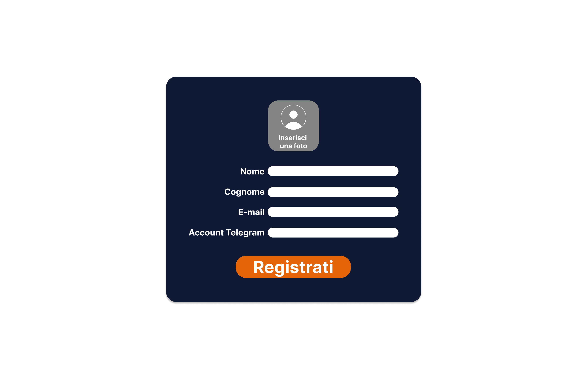
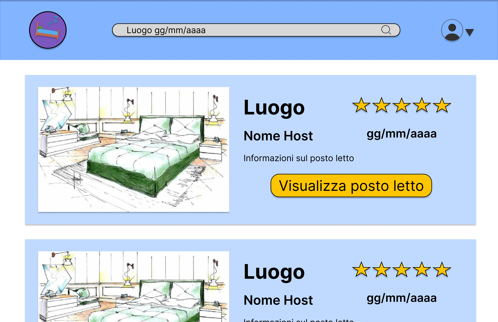
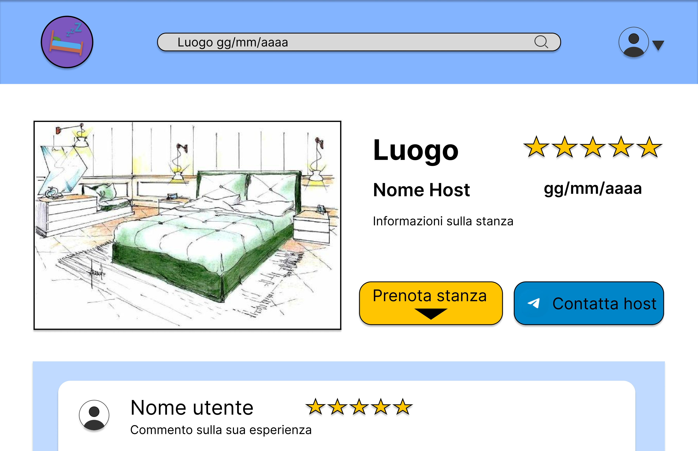
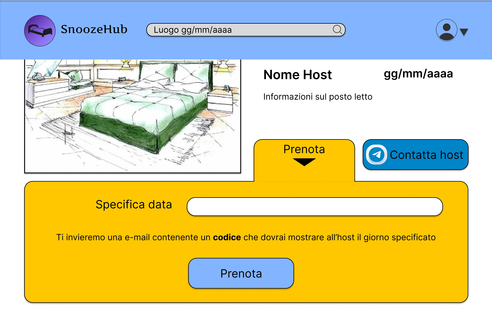
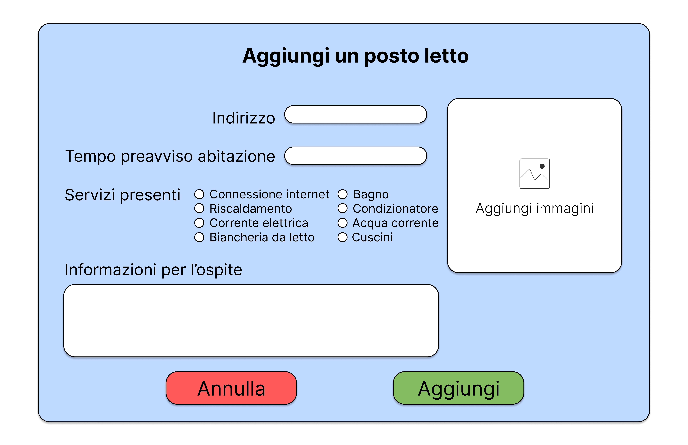
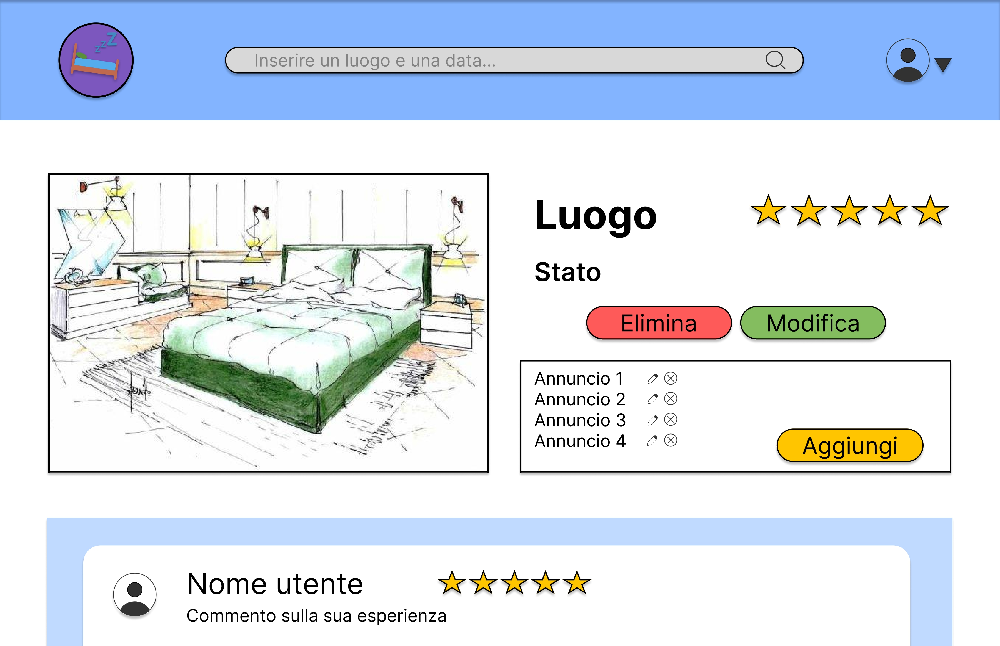
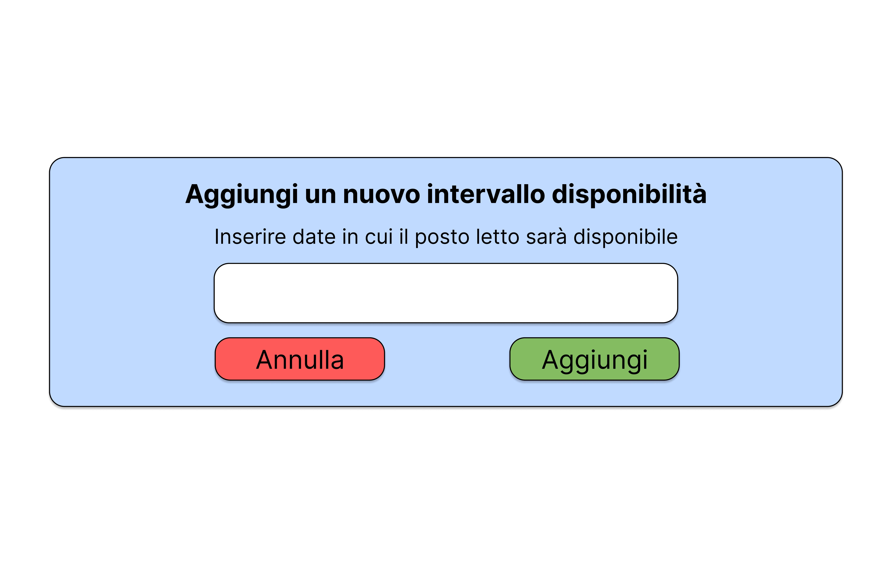
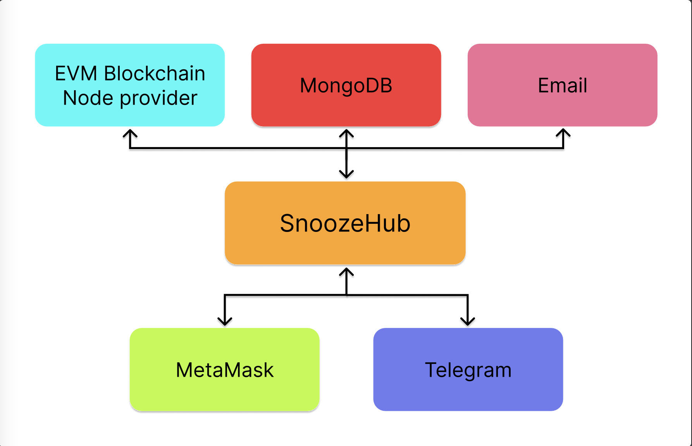

### Table of contents

- [Analisi dei requisiti](#analisi-dei-requisiti)
  - [Obiettivo](#obiettivo)
  - [Requisiti](#requisiti)
    - [Requisiti funzionali](#requisiti-funzionali)
    - [Requisiti non funzionali](#requisiti-non-funzionali)
- [Mockup](#mockup)
- [Sistema](#sistema)

# Analisi dei requisiti

## Obiettivo

Il progetto ha come obiettivo la realizzazione di una piattaforma che consenta agli utenti di barattare posti letto usando un token, chiamato REST, offrendo 2 tipi di servizi:

1. Mettere a disposizione uno o più posti letto in cambio di 1 REST a notte
2. Usufruire di tali posti letto pagando 1 REST a notte per posto letto

Chi ospita viene chiamato _host_, chi viene ospitato _guest_.

## Requisiti

### Requisiti funzionali

#### 1. Utenti:

- RF1.1: Utente anonimo

  Il sistema consentirà agli utenti di visualizzare le stanze disponibili senza doversi registrare o effettuare l'autenticazione.

- RF1.2: Registrazione

  La registrazione di un utente verrà effettuata tramite Metamask, dove verranno richiesti i seguenti dati: nome, cognome, e-mail, ed un account Telegram.

- RF1.3: Verifica Registrazione

  Inseriti i dati della registrazione verrà inviata una mail di conferma contenente un codice segreto.
  Bisognerà verificare tale codice ed aggiungere il proprio account Metamask per i futuri accessi.

- RF1.4: Autenticazione

  Il sistema consentirà agli utenti, già registrati, di autenticarsi tramite Metamask. Questa operazione sarà facoltativa durante la navigazione nel sistema, ma diventerà obbligatoria alla prenotazione di un posto letto.

- RF1.5: RESTs

  Una volta effettuata la registrazione, verranno consegnati 5 RESTs al nuovo account. Questi RESTs verranno utilizzati per pagare un host alla prenotazione di un posto letto e potranno essere guadagnati quando un guest prenoterà un proprio posto letto.
  Il sistema consentirà agli utenti di visualizzare il bilancio dei propri RESTs.

- RF1.6: Uscire dal proprio account

  Il sistema consentirà agli utenti di uscire dal proprio account e di continuare la navigazione come utenti anonimi.

- RF1.7: Eliminare il proprio account

  Il sistema consentirà agli utenti di cancellare il proprio account.

- RF1.8: Visualizzare dati profilo

  Il sistema consentirà agli utenti di visualizzare i dati del proprio profilo.

- RF1.9: Modificare dati profilo

  Il sistema consentirà agli utenti di modificare i dati del proprio profilo.

#### 2. Usufruire di posti letto:

- RF2.1: Cercare posti letto

  Il sistema consentirà di cercare posti letto inserendo un luogo e una o più date: verranno elencati i posti letto in ordine di vicinanza a quel luogo e disponibili in tali date.

- RF2.2: Visualizzare commenti di altri guest

  Il sistema consentirà agli utenti di visualizzare i commenti di altri guest su un determinato posto letto prima di effettuare la prenotazione.

- RF2.3: Visualizzare la valutazione di altri guest

  Il sistema consentirà agli utenti di visualizzare la valutazione di altri guest su un determinato posto letto prima di effettuare la prenotazione.

- RF2.4: Prenotare un posto letto

  Per poter prenotare un posto letto, l'utente dovrà effettuare l'autenticazione, specificare la data/e e successivamente scambiare un REST.

- RF2.5: Visualizzare le proprie prenotazioni

  Il sistema consentirà di visualizzare le proprie prenotazioni.

- RF2.6: Comunicare con gli host

  Il sistema consentirà ai guest di visualizzare il contatto Telegram degli host e di contattarli in caso di bisogno.

- RF2.7: Recensire posti letto

  Dopo aver usufruito di un posto letto, i guest potranno recensirlo descrivendo la loro esperienza.

- RF2.8: Valutare posti letto

  Dopo aver usufruito di un posto letto, i guest potranno valutarlo con un punteggio da 1 a 5.

#### 3. Offrire posti letto:

- RF3.1 Aggiungere un posto letto

  Gli utenti, una volta autenticati, per inserire un posto letto dovranno fornire: l'indirizzo dell'abitazione, da 1 a 5 foto, il tempo di preavviso per la prenotazione e opzionalmente delle informazioni per l'ospite.
  Inoltre, dovranno specificare la presenza dei seguenti servizi:

  - connessione internet
  - bagno
  - riscaldamento
  - condizionatore
  - corrente elettrica
  - acqua corrente
  - presenza biancheria da letto
  - presenza cuscini

- RF3.2: Visualizzare i propri posti letto

  Il sistema consentirà agli utenti di visualizzare i posti letto inseriti.

- RF3.3 Modificare un posto letto

  Il sistema consentirà agli utenti di modificare le informazioni riguardanti i posti letto inseriti.

- RF3.4 Eliminare un posto letto

  Il sistema consentirà agli utenti di eliminare i posti letto inseriti.

- RF3.5 Aggiungere un annuncio

  Sarà possibile scegliere tra i posti letto caricati sul proprio account e specificarne la disponibilità: così facendo verrà creato un annuncio.
  Fatto ciò, gli altri utenti potranno prenotare il posto letto.

- RF3.6: Visualizzare i propri annunci

  Il sistema consentirà agli utenti di visualizzare gli annunci inseriti.

- RF3.7 Modificare un annuncio

  Il sistema consentirà agli utenti di modificare le informazioni riguardanti gli annunci inseriti.

- RF3.8 Eliminare un annuncio

  Il sistema consentirà agli utenti di eliminare gli annunci inseriti.

- RF3.9 Visualizzare i commenti dei guest

  Il sistema consentirà agli host di visualizzare i commenti dei guest.

- RF3.10 Visualizzare le valutazioni dei guest

  Il sistema consentirà agli host di visualizzare le valutazioni lasciate dai guest.

### Requisiti non funzionali

- RNF1: Privacy

  Il sito sarà GDPR compliant. Saranno richiesti agli utenti solamente i dati strettamente necessari al servizio di cui vogliono usufruire, in ottemperanza delle vigenti disposizioni di legge in materia di tutela della privacy e trattamento dei dati, garantendo comunque un livello accettabile di affidabilità.

- RNF2: Memorizzazione

  Il sito utilizzerà MongoDB per memorizzare i dati degli utenti, i loro annunci contenti foto ed informazioni.

- RNF3: Logging & Monitoring

  Il sito consentirà di registrarsi ed autenticarsi con Metamask.

- RNF4: RESTs

  Il token REST sarà decentralizzato su blockchain EVM-compatible, non verrà dunque direttamente implementato dalla piattaforma. Dato che quindi sarà indipendente dalla piattaforma stessa, potrà venire riutilizzato da enti terzi. Dunque ogni servizio che riutilizzerà il token REST dovrà obbligatoriamente implementare esclusivamente i 2 servizi elencati negli obiettivi. Ciò garantirà agli utenti di poter utilizzare i REST anche al di fuori della piattaforma.

- RNF5: Scambio di RESTs

  Gli scambi di REST altro non saranno che transazioni sulla blockchain EVM-compatible.

- RNF6: Assunzione problema speculazioni/inflazioni/deficit o surplus di liquidità del token REST e assunzione problema della distribuzione di liquidità

  Assumiamo che saranno ignorati possibili speculazioni/inflazioni/deficit o surplus di liquidità del token REST e il problema della distribuzione di liquidità. Una causa può essere ad esempio che ogni utente crei più account.

- RNF7: Notifiche

  Verranno inviate email di notifica nei seguenti casi:

  - Registrazione nuovo account (verifica mail)
  - Prenotazione posto letto sia all'host che all'ospite
  - Aggiunta di recensione da parte di un ospite

- RNF8: Sicurezza

  Il sito garantirà la massima sicurezza per gli utenti, avvalendosi del protocollo grpc per la trasmissione dei dati attraverso la rete, e di JWT per autenticare le sessioni. Per la generazione dei JWT verrà utilizzata la signature fornita da Metamask.

- RNF9: Affidabilità

  Essendo il token REST decentralizzato, garantirà agli utenti una maggiore affidabilità in quanto ogni transazione di REST sarà pubblicamente verificabile.

- RNF10: Prevenzione truffe

  La data di creazione di ogni account sarà pubblica, consentendo agli utenti di vedere da quanto tempo un account è presente nel sistema.

- RNF11: Lingua di sistema

  Il sito sarà disponibile in lingua italiana ed inglese.

- RNF12: Prestazioni

  Il sito utilizzerà sistemi di caching per migliorare le prestazioni in situazioni di scarsa connessione.

- RNF13: Compatibilità

  Il sito deve essere mobile-first, deve aderire allo standard w3c e deve essere compatibile con i browsers più utilizzati, quali:

  - Firefox 91 e successivi
  - Chromium 81 e successivi
  - Safari 16 e successivi
  - Edge 88 e successivi

- RNF14: Apprendimento del sistema

  Gli utenti dovranno essere in grado di utilizzare il sistema con sicurezza dopo 30 minuti di utilizzo.

- RNF15: Assunzione problema verifica account Telegram

  Gli account Telegram degli utenti non verranno verificati in quanto risulterebbe troppo complicato.

- RNF16: Foto

  Gli utenti dovranno caricare da 1 a 5 foto per ogni annuncio, mentre potranno caricare al massimo una foto per il proprio profilo. Tutte le foto saranno dovranno avere una dimensione massima di 512kb e dovranno avere un aspect ratio 1:1

# Mockup front-end

Di seguito sono riportati dei mock-up delle schermate del sito. Sono rappresentate le funzioni principali offerte agli utenti.

### - Schermata home

### - Opzioni di login e registrazione

### - Registrazione nuovo utente

### - Conferma codice di verifica

### - Menu gestione account

### - Risultati ricerca stanza

### - Panoramica annuncio

### - Prenotazione stanza

### - Inserimento posto letto

### - Panoramica posti letto caricati

### - Gestione dei propri posti letto

### - Inserimento nuovo annuncio

# Mockup Back-end

Di seguito è presente un modello del Back-end del sito. Esso si interfaccerà direttamente con il database MongoDB, il Node provider della Blockchain EVM e le api per mandare mail, mentre si interfaccerà attraverso il frontend con Telegram e MetaMask.

